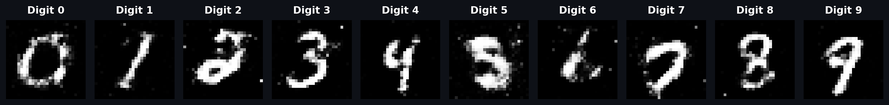
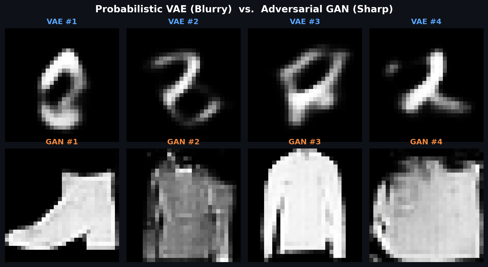
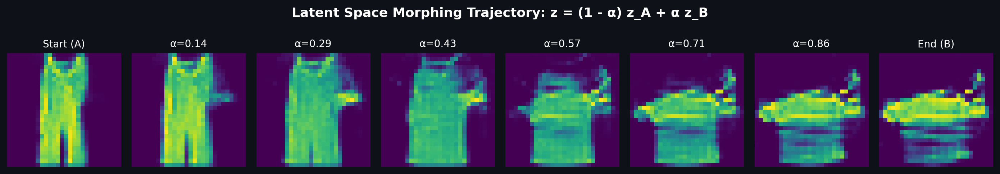
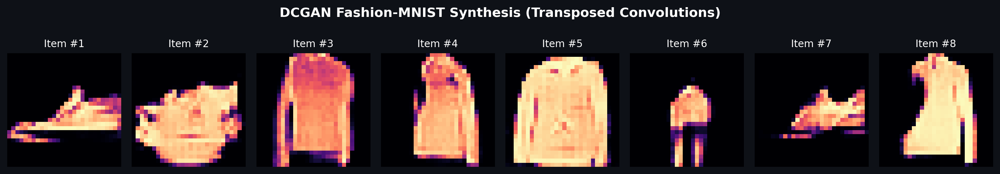

<div align="center">

# 🎨 Generative AI Studio
### *Comparative Study & Interactive Web Studio for VAE, Vanilla GAN, DCGAN & Conditional GAN*

[](https://www.python.org/)
[](https://pytorch.org/)
[](https://YOUR_STREAMLIT_APP_URL_HERE)
[](LICENSE)

[](https://YOUR_STREAMLIT_APP_URL_HERE)

**[🚀 Live Demo Link (Replace with your app URL)](https://YOUR_STREAMLIT_APP_URL_HERE)**

---

[Live Features](#-studio-features--visual-results) • [Architecture Matrix](#-architecture-matrix) • [Deploy on Streamlit](#-how-to-deploy-on-streamlit-cloud) • [Quickstart](#-quickstart) • [Theory & Viva Q&A](#-key-theoretical-insights)

---

</div>

## 📌 Overview

This repository is a comprehensive generative modeling suite implementing four foundational architectures from scratch in **PyTorch** across **MNIST** and **Fashion-MNIST**:

1. **Variational Autoencoder (VAE)** — Probabilistic density modeling via ELBO optimization and reparameterization trick.
2. **Vanilla GAN** — Multi-layer perceptron adversarial minimax game.
3. **DCGAN** — Deep convolutional generative network using transposed 2D convolutions and batch normalization.
4. **Conditional GAN (cGAN)** — Supervised generative synthesis driven by class-label embeddings.

All models are integrated into an interactive **Streamlit Web Studio** (`app.py`) for real-time sampling, latent interpolation, and head-to-head empirical comparison.

---

## 🖼️ Studio Features & Visual Results

### 1. User-Controlled Generation (Conditional GAN)
> Specify any target digit ($0 \to 9$) to synthesize tailored handwriting variations or render complete digit sequences on demand.

<div align="center">
  
</div>

---

### 2. Empirical Comparison: VAE vs. GAN
> Side-by-side analysis under identical dataset conditions: **probabilistic averaging** (blur) vs. **adversarial competition** (sharp contrast).

<div align="center">
  
</div>

---

### 3. Smooth Latent Space Morphing
> Linear interpolation across the latent manifold: $z(\alpha) = (1 - \alpha)z_A + \alpha z_B$.

<div align="center">
  
</div>

---

### 4. DCGAN Synthesis on Fashion-MNIST
> Deep convolutional generation capturing complex clothing silhouettes (boots, sweaters, bags).

<div align="center">
  
</div>

---

## 📊 Architecture Matrix

| Feature | VAE | Vanilla GAN | DCGAN | Conditional GAN (cGAN) |
| :--- | :--- | :--- | :--- | :--- |
| **Domain** | MNIST Digits | MNIST Digits | Fashion-MNIST | MNIST Digits |
| **Model Type** | Probabilistic Autoencoder | Adversarial Minimax | Deep Convolutional | Class-Conditioned GAN |
| **Latent Vector ($z$)** | $\mathbb{R}^{20}$ | $\mathbb{R}^{100}$ | $\mathbb{R}^{100}$ | $\mathbb{R}^{100} + \text{Emb}(y)_{10}$ |
| **Core Layers** | Linear (MLP) | Linear (MLP) | `ConvTranspose2d` + `Conv2d` | Linear + `nn.Embedding` |
| **Loss Function** | $\text{ELBO} = \text{BCE} + D_{\text{KL}}$ | Minimax Adversarial | Minimax Adversarial | Conditional Minimax |
| **Visual Quality** | Smooth & blurry | Sharp edges | Crisp apparel contours | User-guided crisp digits |

---

## 📂 Repository Structure

```plaintext
├── app.py                      # Interactive 5-tab Streamlit Studio (live UI)
├── gan.py                      # Standalone CLI training script for Vanilla GAN
├── PROJECT_REPORT.md           # Comprehensive presentation & viva notes
├── requirements.txt            # Minimal runtime dependencies
├── LICENSE                     # MIT License
├── README.md                   # Project documentation & visual guide
│
├── assets/                     # Demonstration figures & comparison plots
│   ├── cgan_digits.png
│   ├── dcgan_fashion.png
│   ├── latent_morphing.png
│   └── vae_vs_gan.png
│
└── weights/                    # Pretrained PyTorch model checkpoints
    ├── cgan_mnist_weights.pth
    ├── gan_mnist_weights.pth
    ├── gan_weights.pth
    └── vae_weights.pth
```

---

## ☁️ How to Deploy on Streamlit Cloud

You can host this live interactive demo for free on **Streamlit Community Cloud** in 3 simple steps:

1. **Sign in to Streamlit Community Cloud**:
   - Go to [share.streamlit.io](https://share.streamlit.io/) and sign in with your GitHub account.

2. **Deploy the App**:
   - Click **"Create app"** (or **"New app"**).
   - Select your repository: `Suryanshtyagi12/Vae-Gan`.
   - Set **Branch**: `main`.
   - Set **Main file path**: `app.py`.
   - Click **"Deploy!"**.

3. **Add Your Link to the README**:
   - Once deployed, copy your app URL (e.g., `https://vae-gan-studio.streamlit.app`).
   - In [README.md](README.md), replace `https://YOUR_STREAMLIT_APP_URL_HERE` with your live URL.

---

## 🚀 Quickstart & Local Setup

### 1. Clone & Install
```bash
git clone https://github.com/Suryanshtyagi12/Vae-Gan.git
cd Vae-Gan

# Create virtual environment
python -m venv venv
.\venv\Scripts\activate      # Windows (or source venv/bin/activate on Linux/macOS)

# Install dependencies
pip install -r requirements.txt
```

### 2. Launch the Interactive Studio Locally
```bash
streamlit run app.py
```
Open **`http://localhost:8501`** in your browser.

### 3. (Optional) Train Vanilla GAN via CLI
```bash
python gan.py --n_epochs 100 --batch_size 64 --lr 0.0002
```

---

## 🧠 Key Theoretical Insights

* **Why are VAEs blurry while GANs are sharp?**  
  VAEs minimize pixel-wise reconstruction errors (BCE/MSE). In regions of uncertainty, the loss is minimized by predicting the *conditional mean* of pixel intensities, yielding a smooth average blur. GANs employ an adversarial discriminator that rejects blurred pixels as artificial, forcing the generator to synthesize crisp, high-frequency contours.

* **What is the Reparameterization Trick?**  
  Direct stochastic sampling $z \sim \mathcal{N}(\mu, \sigma^2)$ cannot be backpropagated through. Expressing $z = \mu + \sigma \odot \epsilon$ where $\epsilon \sim \mathcal{N}(0, I)$ moves the non-differentiable stochasticity to an auxiliary variable, allowing standard gradient descent on $\mu$ and $\sigma$.

* **How does cGAN steer output classes?**  
  Class label $y$ is mapped to a vector via `nn.Embedding(10, 10)` and concatenated with latent noise $z$. Both Generator and Discriminator are fed the label, constraining the generator to synthesize samples that match the conditioned category.

---

## 📜 License

Distributed under the **MIT License**. See [LICENSE](LICENSE) for details. Developed by **[Suryansh Tyagi](https://github.com/Suryanshtyagi12)**.
